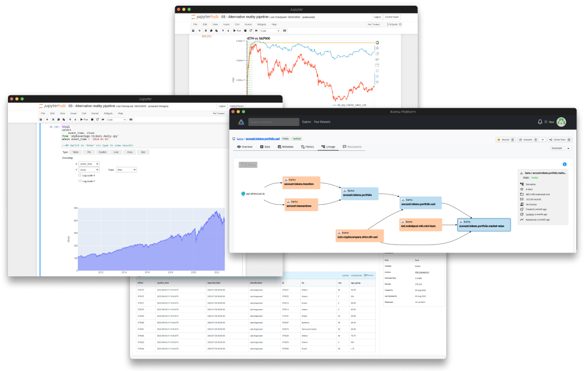

<div align="center">


[](https://github.com/kamu-data/kamu-web-ui/releases/latest)
[](https://github.com/kamu-data/kamu-web-ui/actions)
[](https://discord.gg/nU6TXRQNXC)

</p>
</div>

**Kamu Web Platform** is a **front-end application** that acts as a window into the decentralized [Open Data Fabric](https://docs.kamu.dev/odf/) (ODF) network.

<div align="center">

</div>

Think of it as [Etherscan](https://etherscan.io/) for ODF or GitHub for data pipelines. It can be used in multiple setups:
- On a laptop to explore and build pipelines together with [kamu-cli](https://github.com/kamu-data/kamu-cli)
- Deployed as a private cloud or on-premise data platform in combination with [kamu-node](https://github.com/kamu-data/kamu-node)
- As a window into the global ODF network to interact with millions of decentralized data sources and supply chains.

## Get Started
By far the simplest way to try it out is using [kamu-cli](https://github.com/kamu-data/kamu-cli) - simply [install](https://docs.kamu.dev/cli/get-started/installation/) it and run this command in your workspace:

```sh
kamu ui
```

## Helm Chart
You can deploy Kamu Web platform into a [Kubernetes](https://kubernetes.io/) cluster using [Helm](https://helm.sh/) and our latest chart from [ArtifactHub](https://artifacthub.io/packages/search?org=kamu).

See [deployment manual](https://docs.kamu.dev/node/deploy/) on how to deploy the Web Platform alongside [kamu-node](https://github.com/kamu-data/kamu-node).


## For Developers

### Technologies

- TypeScript, version: 4.6.4;
- [Node.js](https://nodejs.org/en/download/releases/), version: 16.20.2;
- [Angular CLI](https://github.com/angular/angular-cli), version 14.2.0.

### Libraries

- [Angular Material Design](https://material.angular.io/), version: 14.2.7;
- [Angular Service Worker](https://www.npmjs.com/package/@angular/service-worker), version: 14.3.0;
- [Apollo Angular (GQL client)](https://apollo-angular.com/docs/), version: 5.0.0;
- [GraphQL](https://www.npmjs.com/package/graphql), version: 16.7.1;
- [Bootstrap](https://www.npmjs.com/package/bootstrap), version: 5.2.0;
- [Popper.js](https://www.npmjs.com/package/@popperjs/core), version: 2.11.8;
- [Bootstrap Icons](https://www.npmjs.com/package/bootstrap-icons), version: 1.7.1;
- [Angular powered Bootstrap widgets](https://www.npmjs.com/package/@ng-bootstrap/ng-bootstrap), version: 13.0.0;
- [Prettier](https://www.npmjs.com/package/prettier), version: 2.5.1;
- [ngx-markdown](https://www.npmjs.com/package/ngx-markdown), version: 14.0.1;
- [Karma], version: 6.4.2; Jasmine, version: 5.0.2;

### Steps for running

0. Do it once:

   - download and install [Node.js](https://nodejs.org/en/download/releases/), version: 16.20.2

   or

   - install Node.js with [Node.js Version Manager](https://github.com/nvm-sh/nvm).

     Using `nvm` (Node.js Version Manager) makes it easier to install and manage multiple versions of Node.js on a single local environment.

     To install a specific version of node: `nvm install 16.20.2`

1. Install packages that project depends on: `npm install` and `npm run install_pretty_quick`
2. Run application locally: `ng serve` or `npm run start`

### Running with local GQL server

The web UI will by default attempt to connect to the GraphQL server running on `http://localhost:8080`.

If you have the `kamu` tool installed you can use it to serve GraphQL API directly from your workspace using:

```sh
kamu system api-server --http-port 8080
```

Alternatively you can run latest version of the tool with some sample data from a `docker` image:

```sh
# Get the latest image version
docker pull ghcr.io/kamu-data/kamu-base:latest-with-data

# Run with example data
docker run -it --rm -p 8080:8080  ghcr.io/kamu-data/kamu-base:latest-with-data kamu system api-server --http-port 8080 --address 0.0.0.0
```

### Authentication

Authentication requires a JWT secret variable:
- `KAMU_JWT_SECRET` - random base64 string that is used to sign and verify JWT tokens

To authenticate user via GitHub you will also need to pass the following environment variables when running the API server:

- `KAMU_AUTH_GITHUB_CLIENT_ID` - Client ID of your GitHub OAuth app
- `KAMU_AUTH_GITHUB_CLIENT_SECRET` - Client secret of your GitHub OAuth app

### GraphQL schema and code generation

We are using [graphql-codegen](https://www.graphql-code-generator.com/) project to generate typed interfaces based on server's GraphQL Schema and the query templates.

The schema file is located in `resources/schema.graphql`. To refresh it with latest schema from a running server using:

```bash
npm run gql-update-schema
```

To regenerate types and query stubs use:

```bash
npm run gql-codegen
```

> Note: There is currently an issue with codegen where it generates outdated import `import { gql } from 'apollo-angular';`. To fix it we manually revert this line to `import { gql } from '@apollo/client/core';`.

### Development server

Run `ng serve` for a dev server. Navigate to `http://localhost:4200/`. The app will automatically reload if you change any of the source files.

### Code formatter

Run `npm run prettier` for enforce consistent style by parsing your code and re-printing it with its own rules that take the maximum line length into account, wrapping code when necessary.

### Code scaffolding

Run `ng generate component component-name` to generate a new component. You can also use `ng generate directive|pipe|service|class|guard|interface|enum|module`.

### Build:

Run `ng build` to build the project. The build artifacts will be stored in the `dist/` directory.

### Running unit tests

Run `ng test` to execute the unit tests via [Karma](https://karma-runner.github.io).

### Further help

To get more help on the Angular CLI use `ng help` or go check out the [Angular CLI Overview and Command Reference](https://angular.io/cli) page.

### Release procedure

1. While on the feature branch, create a `CHANGELOG` entry for the new version
2. Create PR, wait for tests, then merge
3. Checkout and pull master
4. Run `npm version {patch,minor,major}` - this will increment the version in all places, commit the changes and crate a new git tag
5. Push the version change and the tag: `git push`
6. GitHub Actions will pick up the new tag and create a new GitHub release from it
